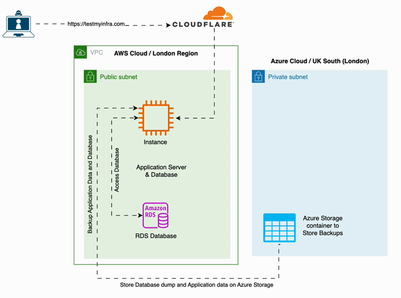
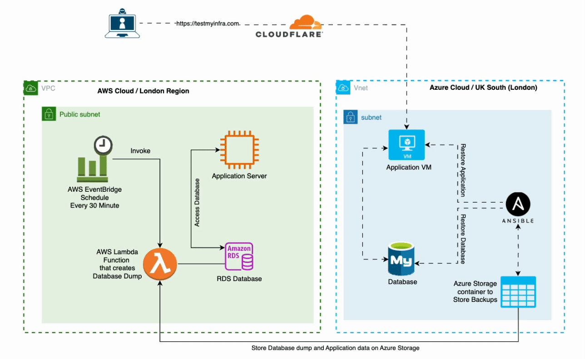

# Backup and Restore Disaster Recovery Implementation on Hybrid Cloud

## Overview

This project aims to provide a robust and scalable solution for disaster recovery by implementing a hybrid cloud approach. Leveraging the power of Terraform, AWS Cloud, Azure Cloud, Cloudflare, Ansible, Python, ShellScripts, Nginx, Certbot, Node.js, AWS RDS MySQL, and Azure MySQL DB, the Backup and Restore Disaster Recovery Implementation ensures the continuity of critical applications in the event of a disaster.

### Branch Structure

The project is organized into 2 branches major directories:

1. **development:** contains nodejs application which input current date and time in mysql database
2.  **infrastructure_development:** Terraform code for main infrastructure and recovery infrastructure

     
### Code Structure

## development branch contains nodejs code

## infrastructure_development branch contains 2 directories

1. **main_infrastructure:** Contains Terraform code for the main infrastructure on AWS.
2. **recovery_infrastructure:** Holds Terraform code for the recovered infrastructure on Azure.


## Local Development Requirements

Ensure your local machine meets the following technology stack requirements:

- **Terraform:** Version 1.6.3 or higher, enforced within Terraform code using `required_version`.
- **Ansible:** Version 2.15.6 or higher.

## Getting Started

### Setting up main Infrastructure on AWS




1. Navigate to the `main_infrastructure` directory in infrastructure_development branch
2. Rename `terraform.tfvars.sample` to `terraform.tfvars`.
3. Add all necessary credentials in `terraform.tfvars`.

Run the following commands:

```bash
terraform init
terraform plan
terraform apply
```
### Disaster Recovery Procedure



#### In case of a disaster, switch to the recovery_infrastructure directory.

```bash
terraform init
terraform plan --var-file ../main_infrastructure/terraform.tfvars
terraform apply --var-file ../main_infrastructure/terraform.tfvars
```
