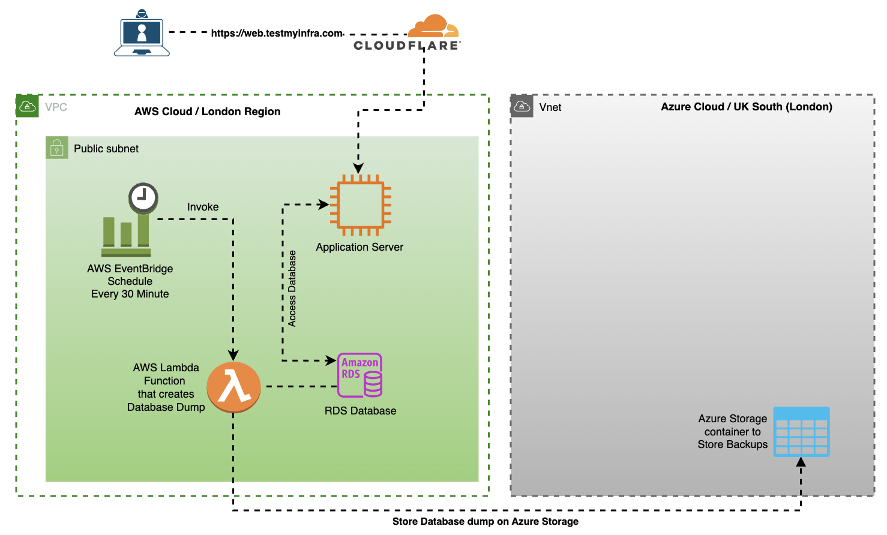
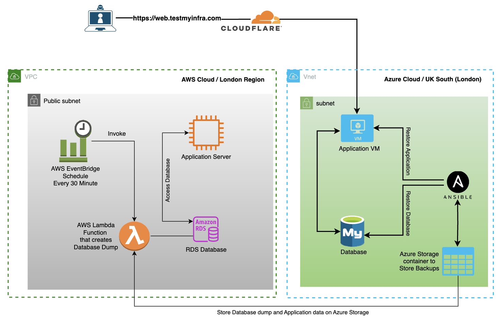

# Achieving Rapid Disaster Recovery with Infrastructure as Code (IaC) in a Hybrid Cloud Environment

## Overview

The aim of this project is to implement a backup and restore disaster recovery (disaster recovery) solution using an infrastructure as code (IaC) tool to achieve rapid recovery in a hybrid cloud environment. The project specifically focuses on leveraging Terraform to automate infrastructure provisioning, application deployment, and configuration management in a hybrid cloud environment where the primary infrastructure resides on Amazon Web Services (AWS) and the recovery infrastructure is hosted on Microsoft Azure. The goal is to establish a comprehensive disaster recovery solution that meets stringent recovery time objectives (RTO) and recovery point objectives (RPO) of 30 Minutes.


### Branch Structure

The project is organized into  2 major branches:

1. **development:** contains nodejs application which input current date and time in mysql database
2.  **infrastructure_development:** Terraform code for primary infrastructure and recovery infrastructure

     
### Code Structure

## development branch contains nodejs code

## infrastructure_development branch contains 2 directories

1. **primary-infrastructure:** Contains Terraform code for the primary infrastructure on AWS.
2. **recovery-infrastructure:** Holds Terraform code for the recovered infrastructure on Azure.


## Local Development Requirements

Ensure your local machine meets the following technology stack requirements:

- **Terraform:** Version 1.4.0 or higher, enforced within Terraform code using `required_version`.
- **Ansible:** Version 2.0.6 or higher.

## Getting Started

### Setting up primary Infrastructure on AWS



1. Navigate to the `primary-infrastructure` directory in infrastructure_development branch
2. Rename `terraform.tfvars.sample` to `terraform.tfvars`.
3. Add all necessary credentials in `terraform.tfvars`.

Run the following commands:

```bash
cd primary-infrastructure
terraform init
terraform plan
terraform apply
```
### Disaster Recovery



#### In case of a disaster, switch to the recovery-infrastructure directory.

```bash
cd recovery-infrastructure
terraform init
terraform plan --var-file ../primary-infrastructure/terraform.tfvars
terraform apply --var-file ../primary-infrastructure/terraform.tfvars
```


## Additional Improvements Pending

This project serves as a basic prototype. In a production environment, we may explore using Kubernetes. While the current setup may not be scalable, it effectively showcases a fully automated infrastructure that requires no manual intervention whatsoever.

